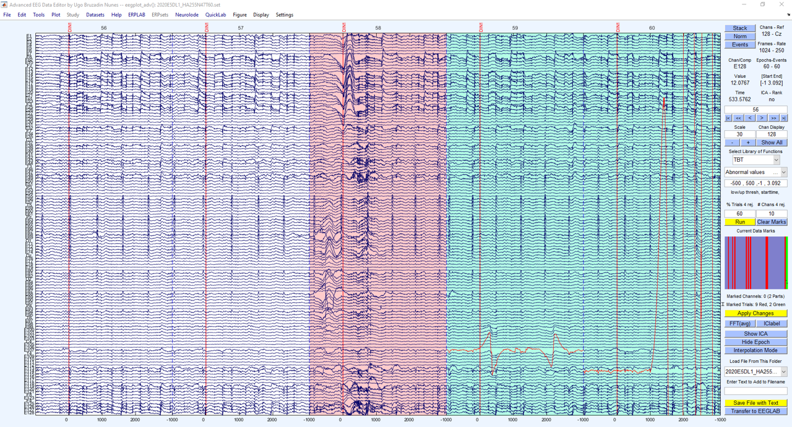

# QuickLab

**Advanced EEG Data Editor for EEGLAB** | MATLAB & GNU Octave

QuickLab is an EEGLAB plugin that replaces the default data scroll viewer with a powerful, interactive preprocessing environment. It combines data visualization, artifact marking, component inspection, and processing into a single tabbed interface.

> "I dreamed of a day when I did not have to interact with prompts while using EEGLAB..."

## Features

### Interactive Data Editor (`eegplot_adv`)
- **Tabbed workspace**: Data, Components, Spectra, and ERP views in one window
- **Color-coded rejection**: Green = interpolation, Red = rejection, per-channel or per-epoch
- **Partial component interpolation**: Remove artifact from a component in a specific time range while preserving data rank
- **Pre/post comparison**: Overlay or difference view after any processing step (sparse diff storage for minimal memory cost)
- **Built-in methods panel**: Run TBT, ICLabel, ICA, BSS, re-reference without leaving the viewer
- **Modern dark theme**: Three color modes (Default, DarkMode, Modern)
- **EEGLAB menu integration**: Access any EEGLAB function from within the viewer
- **GNU Octave compatible**: Full functionality in Octave with graceful degradation

### Keyboard Shortcuts
| Key | Action |
|-----|--------|
| A / D | Scroll left / right |
| Q / E | Jump to start / end |
| W | Toggle EEG / ICA view |
| S | Toggle Interpolation / Rejection mode |
| R | Normalize channels |
| Z | Mark channel under cursor as bad |
| V, B, N, M, H, G | Topoplot modes (variance, std, mean, etc.) |
| +/- | Scale amplitude up / down |
| Arrow keys | Navigate and scroll channels |

### Mouse Controls
- **Left click**: Select epoch for rejection (red) or interpolation (green)
- **Right click**: Mark/unmark channel as bad
- **Middle click**: Topoplot at cursor (channels) or component properties (ICA)
- **Scroll wheel**: Zoom time axis

### Processing Pipeline (Methods Tab)
- **TBT (Trial-by-Trial)**: Automated artifact detection with configurable thresholds
- **QuickLab**: ICA, BSS, re-reference, re-epoch, DIPFIT — all without prompts
- **ICLabel**: Automatic IC classification and rejection
- **Custom scripts**: Run any MATLAB/Octave command on the current data

### Additional Tools
- **Viewprops+** (`pop_viewprops_adv`): Component properties with ICLabel, parallel plotting, and CORRMAP save
- **Spectopo+** (`spectopo_ql`): Interactive frequency topoplot with click-to-inspect
- **Quick Filter**: Highpass/lowpass without prompts
- **Quick CORRMAP**: Fast template-based component rejection

## Installation

### Requirements
- EEGLAB 2019 or later
- MATLAB R2014b+ **or** GNU Octave 6+

### Install
1. Download or clone this repository into your EEGLAB `plugins/` folder:
   ```
   cd eeglab/plugins
   git clone https://github.com/UgoBruzadin/QuickLab.git
   ```
2. Start EEGLAB. QuickLab appears in the menu bar.

### GNU Octave
QuickLab detects Octave automatically and adapts the UI:
- Tabs fall back to panels if `uitabgroup` is not available
- All processing functions work identically
- Install the `signal` and `statistics` Octave packages for full functionality

## File Structure

```
QuickLab/
  eegplugin_QuickLab.m       Plugin entry point (EEGLAB registration)
  QuickLabDefs.m              Configuration defaults (edit to customize)
  gui/                        GUI popup functions (pop_*)
  processing/                 Data processing (quick_*, par_*)
  visualization/              Display and rendering
    eegplot_adv.m             Main viewer (dispatch + utilities)
    eegplot_create_ui.m       UI layout (tabbed panels + controls)
    eegplot_adv_methods.m     Processing method dispatcher
    draw_data.m               Channel trace rendering
    draw_background.m         Rejection patches and events
    eegplot_readkey.m         Keyboard handler
    mouse_down/up/motion.m    Mouse handlers
    quick_colormode.m         Color themes (Default/DarkMode/Modern)
    ...
  utils/                      Shared utilities
    eegplot_defaults.m        g struct field definitions
    inputdlg3.m               Shared input dialog
    ql_isoctave.m             Octave detection
    ql_compat.m               Compatibility layer
    eegplot_compare_snapshot.m Pre/post comparison
    ...
  design/                     Design documents
    TABBED_UI_DESIGN.m        UI architecture specification
```

## Configuration

Edit `QuickLabDefs.m` to customize:

```matlab
SAVEBACKUP = 1;                    % Auto-save before processing
COLOR_MODE = 'Modern';             % 'Default', 'DarkMode', or 'Modern'
ICATYPE = 'cudaica';               % ICA algorithm
EEGTHRESHOLD = [-150, 150];        % Artifact threshold (uV)
CHANNELDEFS = [1:57,59,60];        % Default channel selection
EPOCHLENGTH = 1;                   % Recurrent epoch length (s)
```

## Rejection Matrix

The rejection matrix (bottom-right) shows the current state of all epochs and channels:
- **Red vertical lines**: Epochs marked for rejection
- **Green vertical lines**: Epochs marked for interpolation
- **Black marks**: Partial channel interpolation within an epoch
- **Yellow marks**: Full channel interpolation
- Click on any mark to navigate to that epoch

## Examples



## Contributing

Bug reports and feature requests: [GitHub Issues](https://github.com/UgoBruzadin/QuickLab/issues)

## License

GNU General Public License v2.0 - see [LICENSE](LICENSE)

## Author

**Ugo Bruzadin Nunes** - INL Lab, Southern Illinois University Carbondale

With contributions from the EEGLAB community and Claude (Anthropic).
